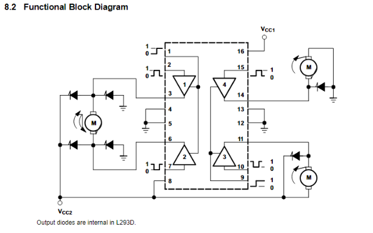
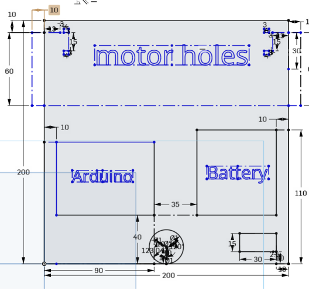
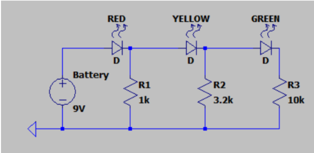
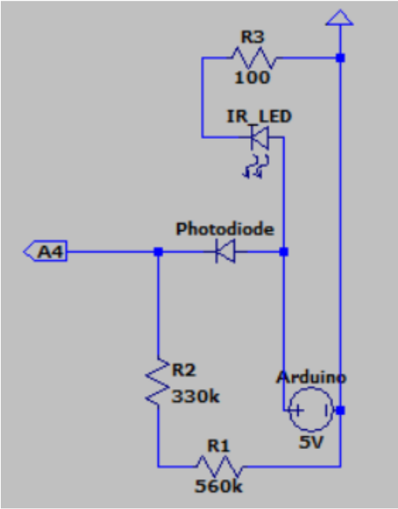
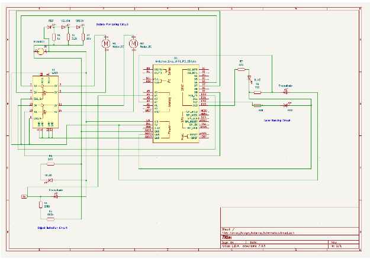

**[← Back to Home](../README.md)**

# Junior Design Project
**Team**: Senri Nakamura, Naomi Arnold, Dani Price, Alex Moy  
---
# Project Overview
In this project, we designed and built a small robotic vehicle capable of autonomously navigating a test track by following colored lanes.  
The system integrates multiple components:
- Arduino Uno  
- Motor control (H-Bridge)  
- Color sensing circuit  
- Obstacle detection circuit  
- Battery monitoring  

This project emphasized the full engineering design process: ideation, prototyping, iterative testing, refinement, and client-oriented communication.  
---
## ⚙️ Bot Specifications
The bot consists of an Arduino Uno, multiple sensor circuits, and a custom acrylic chassis that holds all components together.  

---
## Motor and H-Bridge
We used an **L293D H-Bridge IC** to control two DC motors.  
- Logic voltage vs motor voltage separation  
- Enable pins for control  
- Arduino inputs (3 per side → left & right motors)  
- Forward, reverse, start, and stop functionality
  

---
## Color Sensing Circuit
- Sensor: **CSS001-8001 Photocell**  
- Illumination: Blue & Red LEDs toggled by Arduino  
- Output: Voltage variation read on **A2**  
- Arduino pin 13 → Blue LED, pin 12 → Red LED
  

---
## 🛠️ Chassis
- Designed in **Onshape**  
- Fabricated with **laser-cut acrylic** at Nolop  
- Mounts for motors, OmniBall, and electronics  
- Velcro mounting for flexible circuit placement  
- Wire routing hole for a cleaner, professional look
  

---
## 🔋 Battery Detection Circuit
- Voltage divider network for scaling battery voltage  
- LED indicators: Green → Yellow → Red  
- Displays real-time battery status
  

---
## 🚧 Obstacle Detection Circuit
- IR emitter: **LVIR3333 LED**  
- Detector: **SFH 203 FA photodiode (900nm)**  
- Output amplified with resistor network  
- Output → **A4** on Arduino
  

---
## 🖥️ Arduino Schematics

---
## 👥 Customer Response
We focused on:  
- **Battery usability** → intuitive LED system  
- **Clean design** → hidden wiring, neat chassis  
- **Security** → server communication restricted to trusted IDs  

---
---
## 💻 Code
- GitHub Repo: [Grape Expectations](https://github.com/naomi-arnold/grape_expectations)  

---
