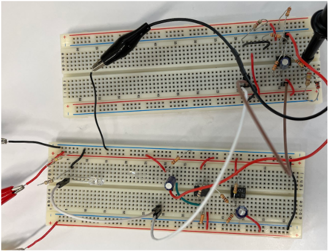
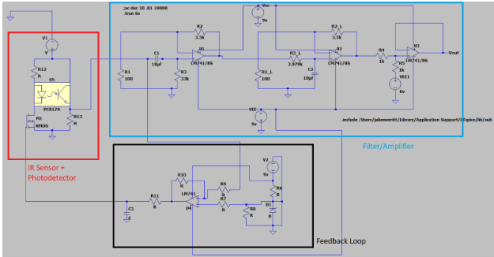
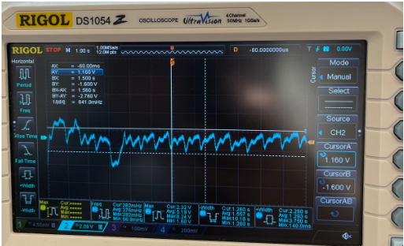
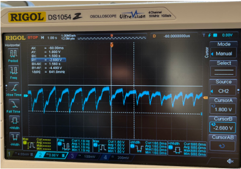
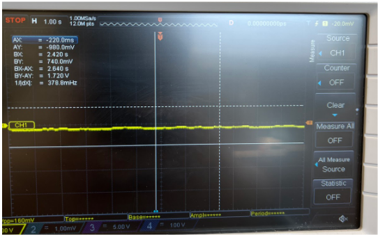

**[← Back to Home](../README.md)**

# Pulse Oximeter
**Team:** Alex Moy, Jacob Merrit  
## Overview  
We designed and built a **pulse oximeter** capable of measuring blood oxygen saturation and heart rate through a finger.  
The device uses an IR LED and photodetector to measure absorbed light, with amplification, filtering, and a **feedback loop** to stabilize readings across users with different skin tones, finger sizes, and conditions.  

---
## Design Approach  
### Sensor  
- **IR LED** transmits through the finger.  
- **Photodetector** receives transmitted light.  
- Small signal (~10 mV) generated based on oxygen content.  

### Filtering & Amplification  
- Heartbeat frequency: **0.5–4 Hz (30–240 bpm)**.  
- Implemented cascaded **bandpass filter** (high-pass + low-pass).  
- Amplification: **Gain ≥ 100** to boost signal to ~1 V.  

### Feedback Loop (Stabilization)  
- Problem: Small fingers → too much light, signal saturation.  
- Solution: **Difference amplifier + NMOS MOSFET** automatically adjusts LED current.  
- Reference voltage stabilized using a **4.7 V zener diode**.  
- Prevents signal clipping while adapting to different users.  

---
## Final Circuit Design
Physical Circuit Design

Circuit Diagram made with Spice

---
## Results  
We tested the oximeter across multiple users and finger positions.  

- **Light Pressure**
  

- **Moderate Pressure**
  
 
 
- **No Finger** (baseline noise level)
  
 

---
## Limitations & Future Improvements  
- **Finger positioning sensitivity** → design a finger guide.  
- **Ambient light interference** → dark enclosure for sensor.  
- **Motion artifacts** → motion detection / signal averaging.  

---
## Ethical Considerations  
- **Privacy & Security**: Patient health data must be protected (HIPAA).  
- **Accuracy & Reliability**: Medical devices must undergo rigorous validation.  
- **Accessibility & Affordability**: Designs should be inclusive and affordable.  
- **Professional Standards**: IEEE Code of Ethics and FDA guidelines followed.  

---
## Conclusion  
Our prototype successfully measures oxygen saturation and heart rate with stabilization. While functional, improvements in **user ergonomics, noise rejection, and motion robustness** are needed for practical deployment. With refinement, this design shows promise as a reliable, low-cost medical device.  

---

