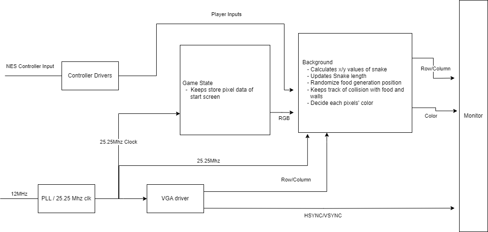
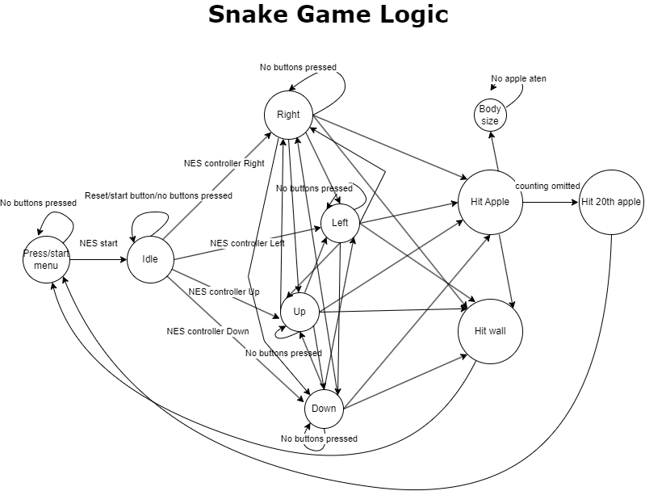

**[← Back to Home](../README.md)**

# Snake Game
**Team:** Senri Nakamura, Alex Moy, Brian Kim  
**GitHub Repo:** [FPGA_snake_game](https://github.com/SenriNakamura/FPGA_snake_game)  

---

## Overview  
We implemented the **classic Snake Game** on an FPGA board, showcasing our understanding of digital design principles and hardware integration.  
The project combines **VHDL modules** for game logic, VGA output, NES controller input, and ROM-based graphics.  

---

## Gameplay  
- Snake moves in a grid, controlled by an **NES controller**.  
- Eating an apple increases length and score.  
- Game ends if:  
  - Snake hits wall → **Lose**  
  - Snake eats 20 apples → **Win**  

---

## System Architecture  
- **FPGA Board** – main processor coordinating all modules.  
- **VGA Output (VHDL)** – renders visuals at 640×480 @ 60 Hz.  
- **NES Controller Module** – reads inputs via serial protocol.  
- **Background Module** – renders game scene, integrates snake and apples.  
- **Game Logic** – manages movement, collisions, apple respawn, scoring.  
- **ROM Module** – stores start screen graphics.  

 

---

## Controls (NES Controller)  
- **Inputs:** D-pad (Up, Down, Left, Right), Start button.  
- Uses **shift register + latch** to decode signals.  
- FPGA slowed its 48 MHz clock → 12 µs period for NES timing.  
- Outputs **8-bit vector** for game logic.  

---

## VGA Module  
- Outputs 640×480 pixels with HSYNC/VSYNC signals.  
- Updates snake & apple positions in sync with frame clock.  
- Visible vs non-visible area controlled via `valid` flag.  
- Coordinates tracked with `(row, col)` mapped into `xy` vector.  

---

## Game Logic  
- Stores snake positions in an array of 32-bit vectors.  
- Head collision drives body updates and growth.  
- Apple respawn is pseudo-random (incrementing x/y with resets).  
- Collision detection checks head vs boundaries + food overlap.  

 

---

## Graphics  
- Snake segments: **20×20 px green blocks**.  
- Apples: **20×20 px red blocks**.  
- Background: solid black for contrast.  
- Start/End Screens: stored in **ROM (memory.vhd)**, rendered at boot/end.  

---

## Results & Reflection  
- Responsive controls → no input lag.  
- Smooth gameplay and simple learning curve.  
- Snake + apple visibility clear (except red-green colorblindness).  
- Limitations:  
  - ROM-based start screen partially failed.  
  - No score counter.  
  - Limited snake max length.  

---

## Division of Work  
- **Senri Nakamura** – Game logic, VGA.vhd, background.vhd, image processing → ROM, debugging.  
- **Alex Moy** – NEScontroller.vhd, top.vhd integration, VGA debug, food respawn fixes, ROM integration.  
- **Brian Kim** – memory.vhd (ROM), Pixilart start screen, ROM → VHDL integration.  

