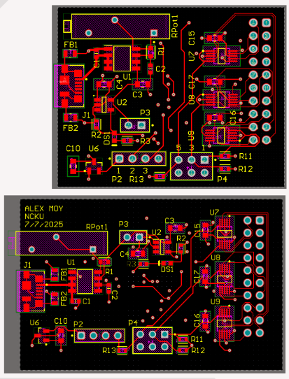

**[← Back to Home](../README.md)**

# Taiwan Research Project: PCB Test Platform

## Project Overview
The research project I was apart of was to design and produc a PCB to be used with an MCU for the purpose of testing onboard components. 
The overall purpose is that this board makes the programming, testing, and measuring process more convenient.
Acting as the Device Under Test, our PCB can be placed in a wide range of conditions and its various components (ADC, DAC, Temperature Sensor, and Clock Generator) can be measured externally through an attached microcontroller that is programmed through a computer. During this project, we were able to practice multiple skills and softwares, like soldering, circuit design, PCB design, and C coding.

---

## Design Process

1. **Research** – Started with a reference design and evaluated which components were available and compatible with our requirements. Compared datasheets, checked footprints, and validated pinouts to ensure smooth integration.  
2. **System Design** – Created and updated schematic circuits for the ADC, DAC, clock generator, and temperature sensor. Defined how each peripheral would interface with the MCU via SPI or I²C, and planned for debugging headers and test points.  
3. **PCB Design** – Iterated through multiple board designs, debating between a 4-layer stack (better signal integrity, easier routing) versus a simpler 2-layer board (cheaper, faster to fabricate). Finalized on a 4-layer layout due to the component pads being more suitable on a 4-layer board
4. **Initial Coding** – Before the final board was ready, tested core functionality with through-hole breakout boards (DAC and clock generator). Wrote simple SPI and I²C drivers in C to validate communication and build confidence before committing to soldering the real board.  
5. **Soldering and Testing** – Our first time working with fine-pitch SMD components. Learned reflow and hot-air soldering techniques, practiced cleaning bridges, and confirmed connections with a multimeter. This stage was as much about learning proper hardware assembly as it was about debugging.  
6. **Main Programming** – Developed and refined drivers for all peripherals: DAC (SPI), ADC (SPI), clock generator (I²C), and temperature sensor (I²C). Integrated them into a single firmware project on the LPCXpresso51U68. Debugged timing conflicts, verified voltage outputs, and implemented a button-controlled toggle to demonstrate system-level functionality.  

---

## Problems Fixed
- **Flexcomm GPIO limitations** – Discovered pins have fixed multiplexing (I²C/SPI/USART) grouped by Flexcomm. Required redesign of pinout and header mapping.  
- **Crystal oscillator mismatch** – PCB oscillator footprint MHz didn’t match Si5351A datasheet → swapped to correct one with same footprint.  
- **I²C stuck low** – Known issue; diagnosed why the bus held low, resolved with reset and pull-up validation.  
- **Unexpected 2.1V on enable pin** – Power switch enable GPIO outputs ~2.1 V → still unsolved.  
- **Spotty LDO/I²C behavior** – Fixed by reflowing joints, resoldering caps/resistors, and fully populating board. Adding all components resolved ADC comm failures.  

---

## Component Notes
### MCU – LPCXpresso51U68 (OM40004UL)
- Chosen over LPC11U35 because dev board + MCUXpresso SDK support made interfacing/coding easier.  

### LDO Regulator – AP7363-SP-13
- Adjustable via resistor divider (1kΩ + 224.4Ω → 3.3 V).  
- Drives the entire 3.3 V plane.  

### Power Switch – AP2171DWG-7
- USB hot-swap power switch, 1.5 A, slew-rate control.  

### DAC – MCP4822-E/SN
- Dual-channel, 12-bit SPI DAC.  
- LDAC tied low for auto-update.  
- Added 0.1 µF decoupling + 2.2 µF output caps for filtering.  

### ADC – MCP3424-E/SL
- 18-bit I²C ADC.  
- Requires pull-ups on SDA/SCL.  
- Supports multiple I²C addresses for flexibility.  

### Clock Generator – Si5351A
- Needs 25 MHz crystal oscillator input.  
- I²C programmable, up to 200 MHz outputs.  

### Temperature Sensor – MCP9700AT-E/TT
- Analog output proportional to temperature.  
- Requires decoupling capacitor for noise suppression.  

---

## Timeline
- **Week 1–2**: Research, datasheets, reference design study.  
- **Week 3–4**: PCB schematic + layout iterations (2 vs 4 layer).  
- **Week 5**: Firmware tests on through-hole breakouts.  
- **Week 6–7**: PCB soldering and assembly.  
- **Week 8+**: Debugging hardware/software integration.  

---
## Key Learnings
- End-to-end workflow from schematic to tested hardware  
- Debugging soldering and PCB-level issues in real hardware  
- Writing and testing embedded drivers for SPI and I²C  
- Integrating multiple ICs on a single test platform
