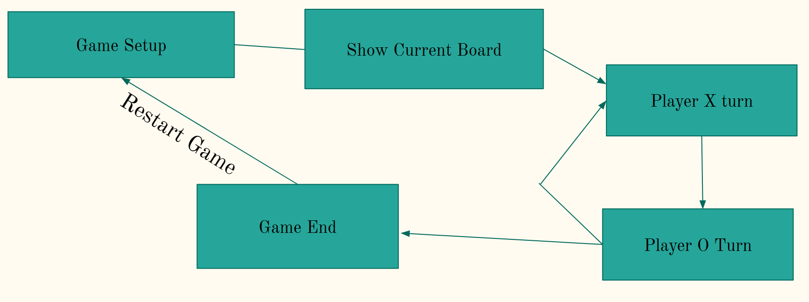
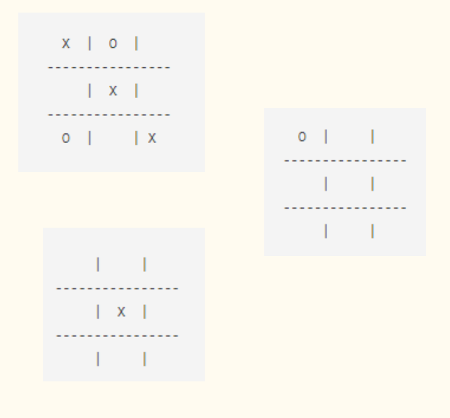
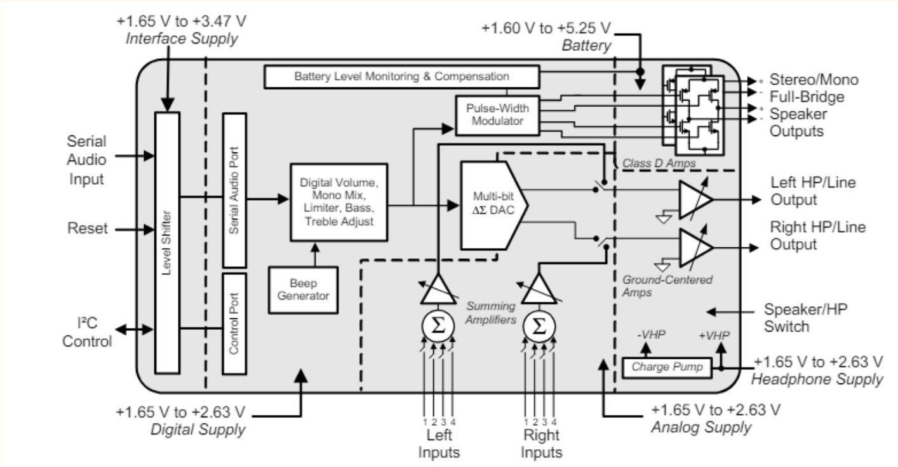

**[← Back to Home](../README.md)**

# Tic Tac Toe
**Team:** Jonathan Guzman & Alex Moy  
---

## Overview
We implemented a **Tic Tac Toe game** using an STM32 microcontroller with UART-based player input and sound effects via an external audio chip.  
The project demonstrates **embedded system integration**: input handling, game state management, and audio output.  

---

## Rules
- Two players alternate turns.  
- Each player places their mark (X or O) on a 3×3 grid.  
- The winner is the first to align three in a row (horizontal, vertical, diagonal).  
- If the grid fills without a winner → draw.  

---

## Game Logic
1. **Game Setup** – Initialize board state and start with Player X.  
2. **UART Input** – Continuously prompt players for moves, reject invalid inputs.  
3. **Data Structures** – 2D array stores game state.  
4. **Board Updates** – Print updated board after each move.  
5. **Winner Check** – Evaluate rows, columns, diagonals after every turn.  
6. **Game End** – Announce winner or draw, reset for new game.  '
   

---

## Board Representation
- Generic 3×3 board (initially empty).  
- Filled dynamically with player X/O symbols.
  

---

## Sound Effects
- **Win:** Rising pitch sequence → C4, E5, G5, C6  
- **Draw:** Falling pitch sequence → E6, B5, F5, C4  

### Audio Implementation
- STM32 communicates with external audio chip via **I²C**.  
- Three registers control:  
  - Frequency  
  - On-time duration  
  - Volume  
- Custom delay functions used to time sequences and create effects.  

---

